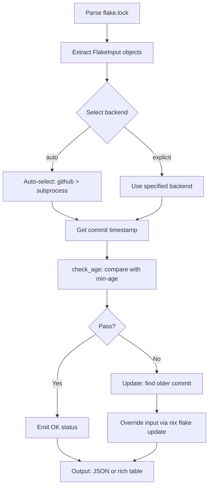

# Architecture Design Document

## Overview

A tool that validates the commit dates of each input in a Nix Flake's `flake.lock`, allowing only commits older than a specified number of days.
This provides a concept equivalent to npm's `min-release-age` for the Nix ecosystem.

It provides two subcommands:

| Subcommand | Description |
|------------|-------------|
| `verify`   | Validates whether existing `flake.lock` inputs meet the minimum age requirement |
| `update`   | Wraps `nix flake update` to adopt only commits that meet the minimum age requirement |

## Directory Structure

```
src/
└── flake_age_filter/         # Core implementation (Typer CLI, core utils)
    ├── cli/                  # Typer commands (verify, update)
    │   ├── __init__.py
    │   ├── _common.py        # Shared CLI utilities (backend setup, token handling)
    │   ├── main.py           # Top-level Typer app
    │   ├── verify.py         # Verify subcommand
    │   └── update.py         # Update subcommand
    ├── core/                 # Core logic and utilities
    │   ├── __init__.py       # Re-exports backend system (getBackend, listBackends)
    │   ├── age_check.py      # Age validation logic (uses whenever.Instant)
    │   ├── errors.py         # Custom exception types (FlakeAgeError)
    │   ├── flake_input.py    # Flake input representation and processing
    │   ├── git_ops.py        # Git operations facade (delegates to backends)
    │   ├── lock_file.py      # flake.lock parsing and input extraction
    │   ├── models.py         # Data models (FlakeInput dataclass)
    │   ├── parallel.py       # Parallel execution utilities (ThreadPoolExecutor)
    │   └── backends/         # Pluggable Git backend system
    │       ├── __init__.py   # Backend registry and auto-selection
    │       ├── base.py       # Abstract base class (GitBackend)
    │       ├── github_api_backend.py  # GitHub REST API backend
    │       ├── subprocess_backend.py  # Git CLI subprocess backend (default)
    │       └── registry.py   # Backend registration and lookup
    └── output/               # Output formatting
        ├── __init__.py
        └── formatters.py     # Console and JSON output formatting (uses rich)
```

## Data Flow



## External Dependencies

| Dependency | Purpose | Notes |
|------------|---------|-------|
| `git` CLI | Fetch commits, list refs, get timestamps | Required for subprocess backend |
| `nix` CLI | Optional: `flake update --override-input` | Fallback to git-only if absent |
| `rich` | Colored CLI output and tables | Used in output/formatters.py |
| `whenever` | UTC datetime handling (Instant) | **Adopted**: replaces stdlib datetime |
| `typer` | CLI framework | Builds the `verify` and `update` subcommands |
| `requests` | HTTP requests for GitHub API | Used in github_api_backend.py |
| `click` | Underlying CLI library for Typer | Transitive dependency |
| `shellingham` | Shell detection for Typer | Transitive dependency |
| `typing-extensions` | Backport of typing features | For compatibility with Python 3.9+ |

## Backend System

The tool uses a pluggable backend system (`core/backends/`) to fetch commit timestamps:

### Available Backends

- **subprocess** (default): Uses `git` CLI commands. No extra dependencies.
- **github**: Uses GitHub REST API v3 via `requests`. Uses `gh` CLI token (`gh auth token`) when available for authentication; falls back to `GITHUB_TOKEN` env var.
- **auto**: Automatically selects backend based on availability (github → subprocess).

### Backend Selection
```bash
# Explicit backend selection
nix-flake-age verify --min-age 30 --method subprocess flake.lock
nix-flake-age verify --min-age 30 --method github flake.lock

# Auto-selection (default)
nix-flake-age verify --min-age 30 flake.lock
```

## Date/Time Handling (CRITICAL)

All timestamps are handled as UTC moments-in-time using the `whenever` library (already adopted):

```python
from whenever import Instant

# Unix timestamp → UTC Instant
instant = Instant.from_timestamp(unix_ts)

# Current time
now = Instant.now()

# ISO string parsing
instant = Instant.parse_iso("2026-04-26T12:00:00Z")

# Extract epoch seconds
epoch = instant.timestamp()

# Formatting
str(instant)  # ISO format
instant.format("YYYY-MM-dd HH:mm UTC")
```

**Never use**: `ZonedDateTime`, `PlainDateTime`, or any timezone-aware types.
This project only operates on UTC moments-in-time.

## Key Data Flow Details

### 1. flake.lock Parsing (`core/lock_file.py`)
- Load JSON, extract `nodes` → list of `FlakeInput` objects
- `FlakeInput` dataclass provides convenience properties: `input_type`, `rev`, `ref`, `is_path`
- URL construction via `to_git_url()` and `to_flake_url()` methods

### 2. Git Backend Resolution (`core/git_ops.py`)
- `get_commit_timestamp(git_url, ref, timeout, method)` → `{"ok": bool, "timestamp": int, "rev": str}`
- Backend auto-selection or explicit choice via `--method` CLI option
- GitHub token via `--github-token` or `GITHUB_TOKEN` env var

### 3. Age Checking (`core/age_check.py`)
- `check_age(commit, now, min_days)` → `{"ok": bool, "age_days": int, "commit_date": str}`
- Uses `whenever.Instant` for all time calculations
- `format_duration(seconds)` for human-readable output

### 4. Update Logic (`cli/update.py`)
- For inputs failing age check, search for older commit:
  - Backend's `find_oldest_commit_meeting_age()` method
  - Binary search through commit history (backend-specific)
- Override input via `nix flake update --override-input <name> <flake_url>`

### 5. Output Formatting (`output/formatters.py`)
- Console output: uses `rich` for colored tables and progress
- JSON output: `--json` flag emits machine-readable JSON to stdout
- Stderr: progress and debug information

## CLI Options

### Common Options (verify & update)
| Flag | Description |
|------|-------------|
| `--min-age DAYS` | Minimum commit age in days (required) |
| `--timeout SECONDS` | Network/git timeout (default: 120) |
| `--parallel N` | Number of parallel workers (default: 4, 0=serial) |
| `--method METHOD` | Backend: subprocess, github, auto (default) |
| `--github-token TOKEN` | GitHub token for API (or set GITHUB_TOKEN env) |
| `--json` | Output results as JSON |
| `--verbose` | Show detailed progress information |

### Verify-specific Options
| Flag | Description |
|------|-------------|
| `--inputs NAME` | Check only specific inputs (can be repeated) |

### Update-specific Options
| Flag | Description |
|------|-------------|
| `--dry-run` | Simulate only; no modifications |
| `--exclude INPUT` | Skip specific inputs (can be repeated) |

## Migration Notes

- Legacy files `flake_age_common.py`, `nix_flake_age_filter.py`, `nix_flake_age_update.py` have been removed.
- All logic now resides in `src/flake_age_filter/` with clear separation of concerns.
- The `whenever` library is **fully adopted** (replaces stdlib `datetime`).
- Backend system implemented with 2 backends + auto-selection.
- Parallel execution via `core/parallel.py` using `ThreadPoolExecutor`.

## Testing
- Unit tests: `tests/unit/` (mock `git_ops` and backends)
- Integration tests: `tests/integration/` (requires git, optional nix)
- Test fixtures: Sample `flake.lock` files in `tests/`
- Run: `python -m pytest -q`
