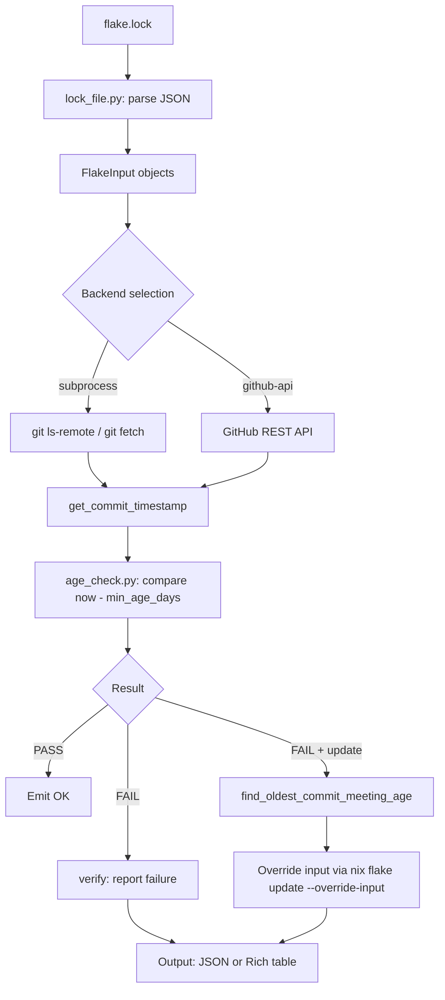

# Nix Flake Age Filter — Design Document

## Overview

A CLI toolkit that validates and enforces minimum-release-age checks on Nix flake inputs, inspired by npm v11.10.0's `min-release-age` feature. It inspects each input's commit date in `flake.lock` and ensures all entries are older than a configurable threshold, providing supply-chain security through freshness gating.

## Commands

| Subcommand | Description |
|---|---|
| `verify` | Validates existing `flake.lock` inputs against the minimum age requirement |
| `update` | Wraps `nix flake update` to adopt only commits that satisfy the minimum age |

## Directory Structure

```
src/
└── flake_age_filter/
    ├── cli/                        # Typer CLI commands
    │   ├── __init__.py
    │   ├── main.py                 # Entry point, Typer app registration
    │   ├── verify.py               # verify command
    │   ├── update.py               # update command
    │   └── _common.py             # CLI shared utilities
    ├── core/                       # Core logic
    │   ├── __init__.py
    │   ├── models.py               # Data models (FlakeInput, etc.)
    │   ├── age_check.py            # Age checking utilities
    │   ├── lock_file.py            # flake.lock loading & parsing
    │   ├── git_ops.py              # Git operations dispatcher
    │   ├── flake_input.py          # FlakeInput dataclass
    │   ├── parallel.py             # Parallel processing (ThreadPoolExecutor)
    │   ├── errors.py               # Error definitions
    │   └── backends/               # Backend implementations
    │       ├── __init__.py
    │       ├── base.py             # Abstract GitBackend base class
    │       ├── registry.py         # Backend registry (auto-discovery)
    │       ├── github_api_backend.py
    │       └── subprocess_backend.py
    └── output/                     # Output formatting
        ├── __init__.py
        └── formatters.py          # Rich console + JSON output
```

## Architecture & Data Flow



## Core Modules

### 1. flake.lock Parsing (`core/lock_file.py`)

- Load `flake.lock` JSON
- Extract `nodes` → list of `FlakeInput` objects
- `FlakeInput` provides: `input_type`, `rev`, `ref`, `is_path`, `to_git_url()`, `to_flake_url()`

### 2. Git Backend System (`core/backends/`)

Abstract base class `GitBackend` defines the interface:

| Method | Description |
|---|---|
| `get_commit_timestamp(git_url, rev, timeout)` | Returns `{"ok": bool, "timestamp": int, "rev": str}` |
| `resolve_default_ref(git_url, ref, timeout)` | Resolves branch/tag to ref name |
| `find_oldest_commit_meeting_age(...)` | Binary-searches commit history for an old-enough commit |
| `list_refs(git_url, timeout)` | Optional: list all branches and tags |

**Available backends:**

| Backend | Selection key | Description |
|---|---|---|
| `SubprocessBackend` | `subprocess` | Uses `git` CLI (`ls-remote`, `fetch`) — required, always available |
| `GitHubAPIBackend` | `github` | Uses GitHub REST API via `requests` — requires network, optional token |
| Auto | `auto` | Selects GitHub API for `github.com` URLs when a token is available, falls back to subprocess |

Backend selection is handled by `core/git_ops.py`, which uses `registry.py` to instantiate the appropriate backend.

### 3. Age Checking (`core/age_check.py`)

- `check_age(commit_info, now, min_days)` → `{"ok": bool, "age_days": int, "commit_date": str}`
- Uses `whenever.Instant` for all UTC datetime operations
- `format_duration(seconds)` for human-readable output

### 4. Update Logic (`cli/update.py`)

For inputs that fail the age check:
1. Call `backend.find_oldest_commit_meeting_age()` (binary search over commit history)
2. Override the input via `nix flake update --override-input <name> <flake_url>#<rev>`
3. If `nix` binary is absent, falls back to building `flake.lock` entries from git history directly

### 5. Output Formatting (`output/formatters.py`)

- **Console**: `rich` library for colored tables, progress bars, and status indicators
- **JSON**: `--json` flag emits machine-readable output to stdout
- **Stderr**: Progress and diagnostic messages go to stderr; final results to stdout

### 6. Parallel Execution (`core/parallel.py`)

- Uses `concurrent.futures.ThreadPoolExecutor` for concurrent age checks
- Configurable via `--parallel N` CLI option

## CLI Options

### Global / Shared

| Flag | Description |
|---|---|
| `--min-age DAYS` | Minimum commit age in days (required) |
| `--timeout SECONDS` | Network/git timeout (default: 120) |
| `--parallel N` | Number of parallel workers |
| `--json` | Output results as JSON |
| `--verbose` | Show detailed progress information |
| `--current-date YYYY-MM-DD` | Override current date for reproducible checks |
| `--method {auto,subprocess,github}` | Force a specific git backend |
| `--github-token TOKEN` | GitHub token (or set `GITHUB_TOKEN`) |

### `verify` specific

| Flag | Description |
|---|---|
| `--inputs NAME` | Check only specific inputs (can be repeated) |
| `--exclude INPUT` | Skip specific inputs (can be repeated) |

### `update` specific

| Flag | Description |
|---|---|
| `--dry-run` | Simulate only; no modifications |

## Date/Time Handling (Critical)

This project uses the `whenever` library exclusively for UTC datetime operations:

```python
from whenever import Instant

# Unix timestamp → UTC Instant
instant = Instant.from_timestamp(unix_ts)

# Current time
now = Instant.now()

# ISO string parsing
instant = Instant.parse_iso("2026-04-26T12:00:00Z")

# Extract epoch seconds
epoch = instant.timestamp()

# String representation
str(instant)

# Custom formatting
instant.format("YYYY-MM-dd HH:mm UTC")
```

**Never use**: `ZonedDateTime`, `PlainDateTime`, `datetime.datetime`, or any timezone-aware types. This project operates only on UTC moments-in-time.

## External Dependencies

| Dependency | Purpose | Notes |
|---|---|---|
| `git` CLI | Commit retrieval, ref listing, timestamp extraction | Required — subprocess backend |
| `nix` CLI | `flake update --override-input`, lock generation | Optional — fallback to git-only mode |
| `rich` | Colored CLI output, tables, progress | Python package |
| `typer` | CLI framework | |
| `whenever` | UTC datetime handling (Instant only) | Fully adopted, replaces stdlib `datetime` |
| `requests` | HTTP requests (GitHub API) | Python package |
| `click` | Underlying CLI library for Typer | Transitive dependency |
| `shellingham` | Shell detection for Typer | Transitive dependency |
| `typing-extensions` | Type hint support | |

## Key Constraints

1. **Purity**: Nix flakes require reproducibility — no `builtins.currentTime`
2. **Git protocol only**: No GitHub API keys required for basic operation; works with any git-compatible host
3. **No narHash calculation**: Computed by `nix flake update`, never manually
4. **Fallback support**: When `nix` binary is absent, builds `flake.lock` from git history directly

## Testing

- **Unit tests**: `tests/unit/` — mock `git_ops` and backend classes
- **Integration tests**: `tests/integration/` — requires `git`, optional `nix`
- **Test fixtures**: Sample `flake.lock` files in `tests/`
- **Run**: `python -m pytest -q`

## Migration Notes

- Legacy files (`flake_age_common.py`, `nix_flake_age_filter.py`, `nix_flake_age_update.py`) have been removed
- All logic now resides in `src/flake_age_filter/` with clear separation of concerns
- `whenever` library is **fully adopted** (replaces stdlib `datetime`)
- Backend system implemented with 2 backends + auto-selection registry
- Parallel execution via `core/parallel.py` using `ThreadPoolExecutor`
